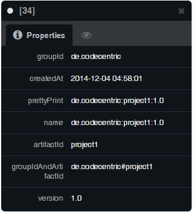
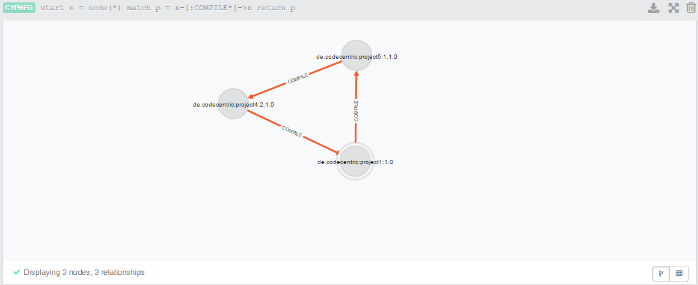

## Running analysis on project

```
cd documentation/dependency-test/project1
$ mvn dependency-mapper:read
[INFO] Scanning for projects...
[INFO]
[INFO] ------------------------------------------------------------------------
[INFO] Building Maven Quick Start Archetype 1.0
[INFO] ------------------------------------------------------------------------
[INFO]
[INFO] --- dependency-mapper-maven-plugin:1.0-SNAPSHOT:read (default-cli) @ project1 ---
[INFO] Resolving reverse dependencies
[INFO] de.codecentric:project3:3.2.1 -> de.codecentric:project1:1.0
[INFO] de.codecentric:project4:2.1.0 -> de.codecentric:project1:1.0
[INFO] de.codecentric:project5:1.1.0 -> de.codecentric:project1:1.0
[INFO] de.codecentric:project5:1.0 -> de.codecentric:project1:1.0
[INFO] de.codecentric:project4:1.0 -> de.codecentric:project1:1.0
[INFO] de.codecentric:project3:1.0 -> de.codecentric:project1:1.0
[INFO] de.codecentric:project2:1.0 -> de.codecentric:project1:1.0
[INFO] ------------------------------------------------------------------------
[INFO] BUILD SUCCESS
[INFO] ------------------------------------------------------------------------
[INFO] Total time: 0.820s
[INFO] Finished at: Wed Dec 03 08:55:42 CET 2014
[INFO] Final Memory: 5M/15M
[INFO] ------------------------------------------------------------------------
```

## Graph Database screenshots








## CYPHER Queries

Delete all nodes and relations

```
MATCH (n)
OPTIONAL MATCH (n)-[r]-()
DELETE n,r
```

Get all projects that have a 'COMPILE' dependency on 'project1' by name

```
MATCH (n)-[:COMPILE]-(dependencies) 
WHERE n.name = "de.codecentric:project1:1.0" 
RETURN n, dependencies
```

Get all projects that have a 'COMPILE' dependency on 'project1' by groupId and artifactId

```
MATCH (n)-[:COMPILE]-(dependencies)
WHERE n.groupId = "de.codecentric" 
AND n.artifactId = "project1" 
RETURN n, dependencies
```

Get all cycles for COMPILE dependencies

```
START n = node(*)
MATCH p =  n-[:COMPILE*]->n
RETURN p
```

Get all cycles for COMPILE dependencies

```
START n = node(*)
MATCH p =  n-[:COMPILE|RUNTIME|PROVIDED|TEST*]->n
RETURN p
```
